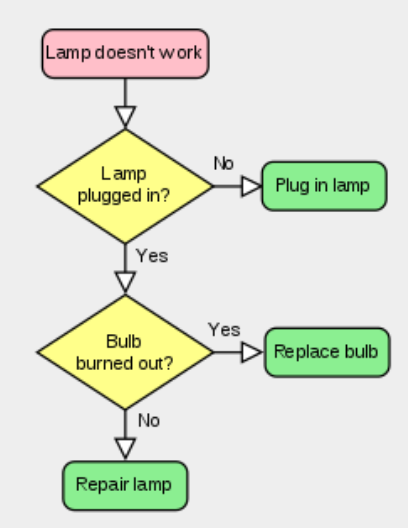
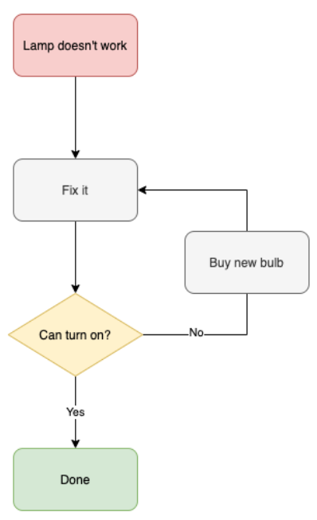

## Brief

### Lesson Overview

The lesson will be focusing on the control structures that help JavaScript perform decision making as well as repeating code blocks using loops.

---

## Part 1 - JS Control Structures

In any programming language, the code needs to make decisions and carry out actions accordingly depending on different inputs. 

For example, in a game, if the player's number of lives is 0, then it's game over.



### If-else statement

The if-else statement is used to specify which block of code is to be executed depending on the condition.

Syntax:
```
if (condition){
    code block to execute when statement is true
} else {
    code block to execute when statement is false
}
```

```js
let x = 20;
if (x > 10){
    console.log(`{x} is greater than 10`);
} else {
    console.log(`{x} is less than 10`)
}
```
We can use the logical operators to add conditions for the if-else statement.

```js
let day = "Saturday";

if(day == "Saturday" || day == "Sunday"){
    console.log("Hooray for the weekend!");
} else {
    console.log("A few more days until the weekend");
}
```

The if-else statement can also be chained to allow for multiple decision branches

```js
let budget = 20;

if(budget > 50){
    console.log("Ride a taxi");
} else if (budget > 30 && budget <= 50){
    console.log("Ride a bus");
} else if (budget > 10 && budget <= 30){
    console.log("Ride a train");
} else {
    console.log("Ride a bike");
}
```

If-else chains can sometimes look disorganized if the chain is long enough, hence, an alternative that can be used is the switch-case statement

### Switch-case statement

The switch-case statement is used to specify many alternative blocks of code to be executed. It uses discrete values as a check for the condition

```js
const environment = "production";

switch (environment) {
  // when environment is specified as production
  case "production":
    console.log("I am production environment");
    break;

  // when environment is specified as staging
  case "staging":
    console.log("I am staging environment");
    break;

  // when environment is not specified or specified as environment
  default:
  case "development":
    console.log("I am development environment");
}
```

The break statement is used to jump out the switch statement.

---

## Part 2 - JS Loops

Programming languages are very useful for rapidly completing repetitive tasks, from multiple basic calculations to just about any other situation where you've got a lot of similar items of work to complete.

Loops can execute a block of code a number of times. Loops are handy, if you want to run the same code over and over again, each time with a different value.



There are three kinds of basic loops:
- while - loops through a block of code while a specified condition is true
- do/while - also loops through a block of code while a specified condition is true
- for - loops through a block of code a number of times

### While loop

The while loop loops through a block of code as long as a specified condition is true.

Syntax
```
while (condition) {
    code block to be executed
}
```
If counters are to be used as conditions, it's important to have an increment or decrement to change the value of the counters. 

If the condition of the while loop becomes always true, it will run indefinitely and this condition is called *infinite loop*.

```js
let whileCount = 0;

while(whileCount < 10){
    console.log(whileCount);
    whileCount++;
}
```

### Do-while loop

The do-while loop also loops through a block of code as long as a specified condition is true.

However, the main difference between a do-while and while loop is that a do-while executes the code block at least once. This is because the do-while loop performs the code block first before checking the condition.

```js
let doWhileCount = 0;
//Try changing the value of doWhileCount to be greater than 10.
do {
    console.log(doWhileCount);
    doWhileCount++;
}while(doWhileCount < 10);
```

### For loop
The for statement creates a loop with 3 parts:

Syntax:
```
for (Initial statement; Condition; Increment/Decrement) {
  // code block to be executed
}
```
The initial statement is executed (one time) before the execution of the code block.

The condiition statement defines the condition for executing the code block.

The increment/decrement is executed (every time) after the code block has been executed.

```js
for(let i = 5; i < 20; i++){
    console.log(`The current value is ${i}`);
}
```

The for loop is especially useful when looping through the values of an array.